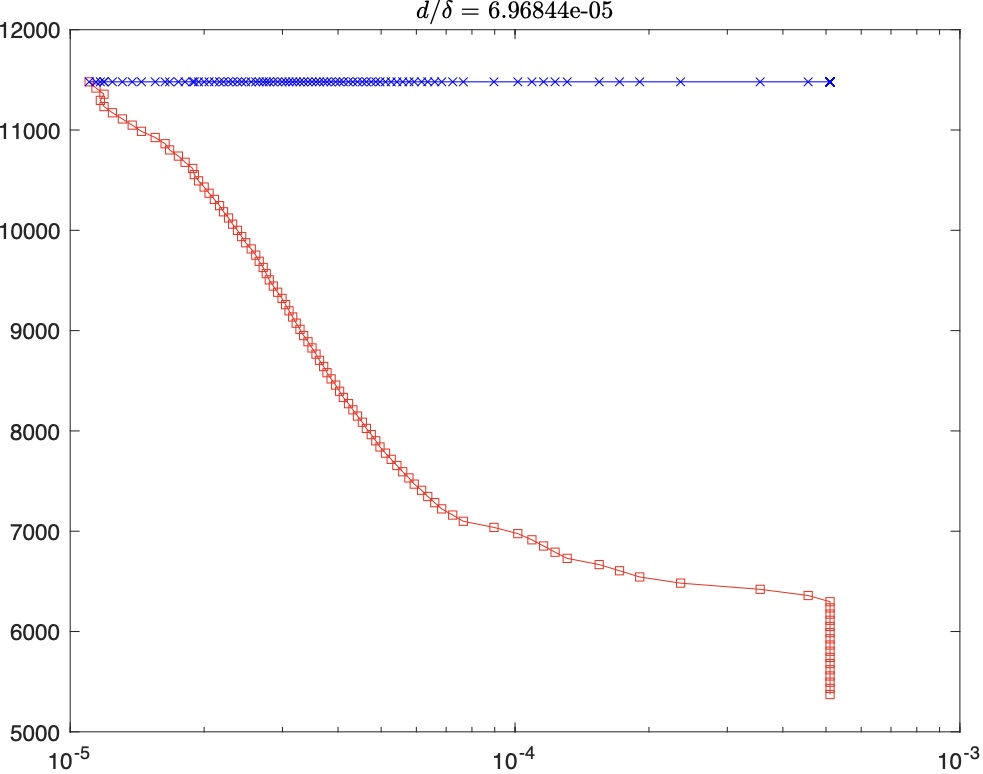

## Description of Dimensionalization Process in the Program

### Adopted Physical Parameters
To ensure consistency with the physical parameters reported in Reference [1], the program employs various material properties as illustrated in the accompanying figure. 


Using the above values, the shear stress applied to the droplet is calculated as $$\tau = \rho_c (\delta u_d)^2$$where $\rho_c = 1000 \rm{kg/m^3}$ is the mass density of the continumm phase fluid.

The implementation incorporates Taylor's frozen turbulence hypothesis to convert spatial sequences along the streamwise direction of the three-dimensional flow field into temporal sequences. The temporal scale $\delta t$ is determined by the streamwise grid spacing $\Delta x$ and a certain value $0.8U_{inf}$ is chosen as the local convection velocity:
$$\delta t = \Delta x/(0.8U_{inf})$$

### Reynolds Number Conversion
The experimental configuration in Reference [1] was established for Taylor-Couette flow, where the Reynolds number is defined as:
$$Re = \frac{\omega_i r_i d}{\nu}$$
where $\omega_i$ represents the angular velocity of the inner cylinder, $r_i$ the inner cylinder radius, $d$ the gap width, and $\nu$ the kinematic viscosity.

For Taylor-Couette flow, the dimensionless torque parameter $G$ characterizes the externally applied torque:
$$G = \frac{\tau}{2\pi L\rho \nu^2}$$
where $\tau$ denotes the applied torque, which equivalently corresponds to the total wall shear stress ($\tau = \tau_w$). Empirical analysis yields the relationship:
$$G = KRe^{1.58}$$

Through substitution of these expressions into the definition of friction Reynolds number $Re_\tau = \frac{u_\tau d}{\nu}$, we establish the conversion relationship between the experimental Reynolds number $Re$ and the friction Reynolds number $Re_\tau$ as reported in Reference [1].

### Figure Plotting Issue ( Vertical Axis )


For the vertical axis in the above figure, it represents the threshold of shear stress acting on droplets, which is a dimensional quantity with units of N/m². Since the fluid viscosity $\nu$ and half-channel width $\delta$ have been predefined in the program, the computed friction velocity $u_\tau$ will consequently increase with higher Reynolds numbers. During the shear stress calculation process, dimensionalization is implemented using $\rho_cu_\tau^2/2$, causing the scale on the vertical axis to grow substantially with rising Reynolds numbers. The shear stress computation and its dimensionalization procedure can be referenced in the following code segments from `threshold_line.m` and `condition_function.m`:
```
physical_threshold = threshold_series*0.5*rho_c*u_tau^2;
```

### Reference

[1] Yi L, Toschi F, Sun C. Global and local statistics in turbulent emulsions. Journal of Fluid Mechanics. 2021;912:A13. doi:10.1017/jfm.2020.1118
